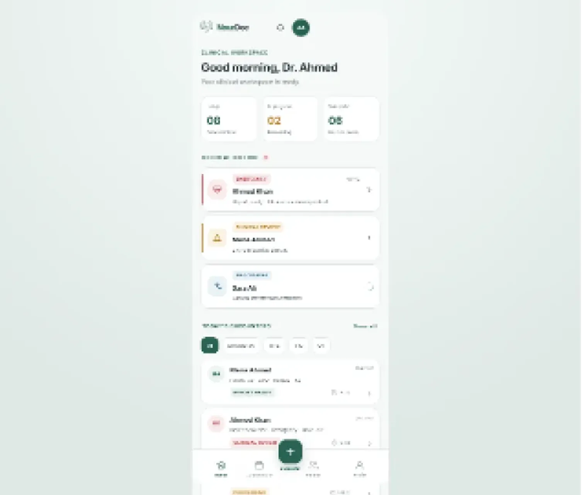

# NourDoc 2.0 — Intelligent Clinical Workspace

**Flutter mobile UI | Clinical workflow demonstration | Mock-data prototype**

NourDoc 2.0 is a Flutter-based interface for an intelligent clinical workspace. This repository demonstrates a clinician-facing journey from onboarding and patient selection to encounter recording, AI-processing screens, structured clinical reports, risk review, and subscription/billing screens.

> **Project status:** This repository implements the **frontend UI and local demonstration flows**. It is **not a production clinical system**. Patient details, reports, recording/processing states, sign-in, and payment flows shown here are mock or simulated. There is no connected authentication service, clinical AI backend, patient database, live audio-capture integration, or payment processing integration in this project.



## Contents

- [Technology stack](#technology-stack)
- [Interface modules](#interface-modules)
- [Application flow](#application-flow)
- [Repository structure](#repository-structure)
- [Getting started](#getting-started)
- [Testing and quality checks](#testing-and-quality-checks)
- [Build an Android APK](#build-an-android-apk)
- [Design system](#design-system)
- [Mock data and future integrations](#mock-data-and-future-integrations)
- [Design references](#design-references)

## Technology stack

| Area | Technology / configuration |
| --- | --- |
| App framework | Flutter (Dart) |
| Dart SDK constraint | `^3.8.1` (see `pubspec.yaml`) |
| UI system | Material 3 with custom NourDoc styling |
| Typography | Google Fonts / Inter (`google_fonts: ^6.3.2`) |
| Localization/formatting package | `intl: ^0.20.2` |
| Icons | Material and Cupertino icons (`cupertino_icons: ^1.0.8`) |
| Navigation | Flutter `MaterialApp` named routes and a custom bottom-navigation shell |
| Demo data | In-repository Dart mock models and mock records |
| Testing | `flutter_test` and `flutter_lints` |

The repository contains Flutter runner folders for Android, iOS, web, Windows, macOS, and Linux. The **experience documented here is primarily a mobile application UI**, not a separate website or web backend.

## Interface modules

The app registers **52 screen destinations**, plus the reusable main-navigation shell, in `lib/app/app.dart` and `lib/app/routes/app_routes.dart`.

| Module | Screens and demonstrated experiences |
| --- | --- |
| **Onboarding & access** | Splash, onboarding, sign-in, verification, clinician registration; includes direct demo entry |
| **Clinical workspace** | Dashboard/home, consultation listing, notifications, empty/error-state showcases |
| **Patients** | Search, patient profile, clinical timeline, previous reports |
| **New encounter** | Select patient, choose care setting, enter intake/vitals, review previous clinical context |
| **Recording & processing** | Ready, in-progress, paused and submitted recording states, and AI-processing visualization |
| **Consultation & reports** | Consultation details, report overview, SOAP, ICD-10/CPT coding, evidence, transcript mapping, clinical risks, risk details, transcript, final review |
| **Subscription & billing** | Plan listing/details/comparison/upgrade, subscription and usage, payment-method selection, card/JazzCash/EasyPaisa/bank-transfer UI, payment status and invoice history |
| **Account** | Profile, settings, notification settings, security |

**Important:** A screen or button appearing in this UI does not imply a live service is connected. For example, the recording screen runs a display timer and waveform animation; sign-in and payment screens simulate progression rather than performing authentication or charging a card.

## Application flow

A typical **demo navigation** path is:

```text
Splash → Onboarding → Sign In → Verification → Main Navigation
                              └── Direct Demo Access → Main Navigation

Main Navigation
├── Home (Clinical Workspace)
├── Schedule (Consultations)
├── Encounter (+) → Select Patient → Care Setting → Intake
│                 → Clinical Context → Recording → Submission
│                 → AI Processing → Consultation / Report Review
├── Patients → Search → Profile / Timeline / Previous Reports
└── Profile → Settings / Subscription / Billing

Clinical Report
├── Overview
├── SOAP Documentation
├── ICD-10 / CPT Coding
├── Evidence and Transcript Mapping
├── Clinical Risk Review
├── Transcript
└── Final Clinical Review
```

This is a **high-level guide** to available screen connections, not a guarantee that every demo path preserves state end to end.

The navigation shell displays **Home**, **Schedule**, **Encounter**, **Patients**, and **Profile**. The center Encounter action opens patient selection. The other four destinations are managed by an `IndexedStack`.

## Repository structure

The following structure is based on screen imports, routes, and files verified in the repository. Screen filenames are shown to make future maintenance and API integration easier.

```text
nourdoc-2.0-ui/
├── android/                         # Android Flutter host project
├── ios/                             # iOS Flutter host project
├── linux/                           # Linux Flutter host project
├── macos/                           # macOS Flutter host project
├── web/                             # Flutter web runner
├── windows/                         # Windows Flutter host project
├── assets/
│   └── images/                      # Registered app image assets
├── lib/
│   ├── main.dart                    # Flutter entry point; portrait orientations
│   ├── app/
│   │   ├── app.dart                 # MaterialApp + screen route resolution
│   │   ├── routes/
│   │   │   └── app_routes.dart      # Named route constants
│   │   └── navigation/
│   │       └── main_nav_shell.dart  # Bottom navigation / IndexedStack
│   ├── core/
│   │   └── theme/
│   │       ├── app_colors.dart      # Brand and semantic colors
│   │       ├── app_typography.dart  # Inter text styles
│   │       ├── app_spacing.dart     # Consistent spacing tokens
│   │       ├── app_radius.dart      # Border-radius tokens
│   │       ├── app_shadows.dart     # Reusable shadow presets
│   │       └── app_theme.dart       # Main Flutter ThemeData
│   ├── models/
│   │   └── mock/
│   │       ├── mock_models.dart     # Patient, consultation, report etc. models
│   │       └── mock_data.dart       # Static demonstration records
│   ├── shared/
│   │   └── widgets/                 # Reusable UI widgets; examples:
│   │       ├── app_button.dart
│   │       ├── app_text_field.dart
│   │       ├── brand_logo.dart
│   │       ├── clinical_badges.dart
│   │       └── organic_waveform.dart
│   └── features/
│       ├── auth/
│       │   ├── splash_screen.dart
│       │   ├── onboarding_screen.dart
│       │   ├── sign_in_screen.dart
│       │   ├── verification_screen.dart
│       │   └── doctor_registration_screen.dart
│       ├── workspace/
│       │   ├── workspace_screen.dart
│       │   ├── notifications_screen.dart
│       │   ├── empty_states_screen.dart
│       │   └── error_states_screen.dart
│       ├── patients/
│       │   ├── patient_search_screen.dart
│       │   ├── patient_profile_screen.dart
│       │   ├── patient_timeline_screen.dart
│       │   └── previous_reports_screen.dart
│       ├── encounters/
│       │   ├── select_patient_screen.dart
│       │   ├── care_setting_screen.dart
│       │   ├── patient_intake_screen.dart
│       │   └── clinical_context_screen.dart
│       ├── recording/
│       │   ├── recording_ready_screen.dart
│       │   ├── recording_in_progress_screen.dart
│       │   ├── recording_paused_screen.dart
│       │   └── consultation_submitted_screen.dart
│       ├── processing/
│       │   └── ai_processing_screen.dart
│       ├── consultations/
│       │   ├── consultations_screen.dart
│       │   └── consultation_detail_screen.dart
│       ├── reports/
│       │   ├── patient_report_overview_screen.dart
│       │   ├── patient_report_soap_screen.dart
│       │   ├── patient_report_coding_screen.dart
│       │   ├── patient_report_evidence_screen.dart
│       │   ├── evidence_transcript_mapping_screen.dart
│       │   ├── patient_report_transcript_screen.dart
│       │   └── final_clinical_review_screen.dart
│       ├── clinical_risk/
│       │   ├── patient_report_risk_screen.dart
│       │   └── risk_detail_screen.dart
│       ├── subscription/
│       │   ├── plans_screen.dart
│       │   ├── plan_detail_screen.dart
│       │   ├── compare_plans_screen.dart
│       │   ├── upgrade_plan_screen.dart
│       │   ├── my_subscription_screen.dart
│       │   └── usage_limits_screen.dart
│       ├── billing/
│       │   ├── payment_method_screen.dart
│       │   ├── stripe_payment_screen.dart
│       │   ├── jazzcash_payment_screen.dart
│       │   ├── easypaisa_payment_screen.dart
│       │   ├── bank_transfer_screen.dart
│       │   ├── payment_pending_screen.dart
│       │   ├── payment_success_screen.dart
│       │   ├── payment_failed_screen.dart
│       │   └── invoice_history_screen.dart
│       └── profile/
│           ├── profile_screen.dart
│           ├── settings_screen.dart
│           ├── notification_settings_screen.dart
│           └── security_screen.dart
├── test/
│   └── widget_test.dart             # Smoke and multi-viewport widget tests
├── analysis_options.yaml           # Lint rules
├── pubspec.yaml                    # Dependencies, SDK and assets
├── pubspec.lock                    # Resolved dependencies
├── figma_thumbnail.png             # Design-preview asset
├── figma_thumbnail_1280.png        # Design-preview asset
├── figma_thumbnail_900.png         # Design-preview asset
├── NourDoc_New_Flutter_UI_From_Scratch_Master_Prompt.md
│                                   # Original Flutter UI implementation brief
└── README.md
```

> The `shared/widgets/` list shows **verified examples**, not an exhaustive inventory of that folder. The layout above intentionally avoids suggesting unverified services, controllers, API layers or backend directories.

### Key code entry points

- **`lib/main.dart`** initializes Flutter, restricts orientation to portrait, and starts `NourDocApp`.
- **`lib/app/app.dart`** configures the Material app, styling, splash screen, and route destinations.
- **`lib/app/routes/app_routes.dart`** defines named route paths used by buttons and screen navigation.
- **`lib/app/navigation/main_nav_shell.dart`** manages the five-item bottom bar, with Encounter as an action.
- **`lib/core/theme/`** stores centralized UI design tokens and `ThemeData`.
- **`lib/models/mock/`** defines local models and demonstration data.
- **`lib/features/`** organizes UI screens by clinical or account function.
- **`lib/shared/widgets/`** holds reusable view components.

## Getting started

### Prerequisites

- Flutter SDK installed, with a Dart SDK compatible with the repository's `^3.8.1` constraint.
- Android Studio or VS Code with Flutter/Dart tooling.
- Android emulator or a USB-connected Android phone (or an appropriately configured iOS simulator on macOS).

### Clone and run

```bash
git clone https://github.com/mnoumanrasheed/nourdoc-2.0-ui.git
cd nourdoc-2.0-ui
flutter doctor
flutter pub get
flutter devices
flutter run
```

To select a particular target:

```bash
flutter run -d <device_id>
```

Replace `<device_id>` with an ID shown by `flutter devices`. The repository also includes a Flutter web runner; to try it in a browser with Chrome available, you may run `flutter run -d chrome`, although the UI is designed primarily for phone-sized screens.

### Demo entry

From onboarding, open the sign-in screen and select **Direct Demo Access** to view the main clinical workspace without a live login service.

## Testing and quality checks

```bash
flutter analyze
flutter test
```

The committed `test/widget_test.dart` contains a splash/onboarding smoke test and widget tests configured for these mobile viewport dimensions:

- `375 × 812`
- `390 × 844` (design baseline)
- `393 × 852`
- `430 × 932`

These are **tests present in source code**. Their current passing status should be confirmed by running the commands above locally or in CI; the README does not assert that they were executed during this documentation review.

## Build an Android APK

```bash
flutter pub get
flutter build apk --release
```

Flutter's default release APK output path is:

```text
build/app/outputs/flutter-apk/app-release.apk
```

For a Play Store-oriented Android App Bundle, run:

```bash
flutter build appbundle --release
```

Before public distribution, configure app identifiers, versioning, release signing, branding, policies, and production integrations as required. An APK built from this repository remains a **UI demonstration**, not a working medical-recording or payment application.

## Design system

The NourDoc interface uses a clinical visual language with shared design tokens:

| Token | Value | Typical use |
| --- | --- | --- |
| Deep Jade | `#286252` | Primary brand/action color |
| Fresh Jade | `#3F8F82` | Secondary brand accents |
| Pale Jade | `#EAF4F1` | Light accent backgrounds |
| Clinical Blue | `#477C9B` | Informational indicators |
| Warm Amber | `#D9A441` | Processing / attention |
| Rose | `#C85C5C` | Risk and error indicators |
| Charcoal | `#24343B` | Primary text |

Inter typography, standardized spacing, border radii, shadows, and theme configuration are maintained in `lib/core/theme/`. Most app images are registered via `assets/images/` in `pubspec.yaml`.

## Mock data and future integrations

### Currently demonstrated

- Local patient and consultation records, vitals, care settings, SOAP sections, code suggestions, evidence, risks, subscription plans, and invoices.
- UI transitions for sign-in, recording stages, clinical processing, review, and payment outcomes.
- Reusable controls and local screen navigation.

### Not connected in this repository

- Production authentication and clinician verification.
- Live audio capture, storage, speech-to-text, or AI clinical processing.
- A patient-record database or medical-records API.
- Live ICD-10/CPT coding or clinical risk inference.
- Payment gateways (Stripe, JazzCash, EasyPaisa, bank verification) and real subscription management.

**Privacy and safety:** Do not enter real patient information or actual payment-card details into the demonstration UI. Any future production application handling clinical information requires appropriate security, data protection, clinical validation, auditability, and regulatory review.

### Suggested integration approach (future work, not an existing feature)

Keep visual widgets under `features/` and `shared/widgets/`; introduce dedicated API clients, typed response models, repositories, and state management **when** backend endpoints and data contracts are defined. Replace `MockData` incrementally rather than connecting network calls directly inside every screen.

## Design references

- [Source code repository](https://github.com/mnoumanrasheed/nourdoc-2.0-ui)
- [Flutter UI implementation brief](NourDoc_New_Flutter_UI_From_Scratch_Master_Prompt.md)
- [Figma design reference named in the implementation brief](https://www.figma.com/make/VTbiUqbOfOwTP4G9HYNelw/NourDoc-Mobile-UI-UX-Design?t=pFaUl0ovGqMxlV4B-1)

---

**Repository:** `mnoumanrasheed/nourdoc-2.0-ui`  
**Application package name in `pubspec.yaml`:** `nourdoc`  
**Scope of this README:** Current GitHub `main` branch as reviewed on 11 October 2026.
